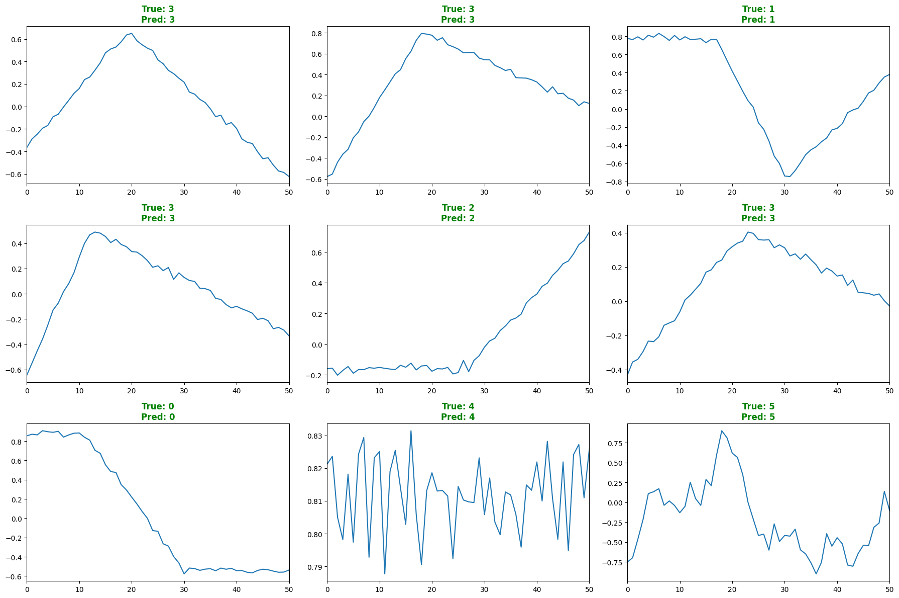
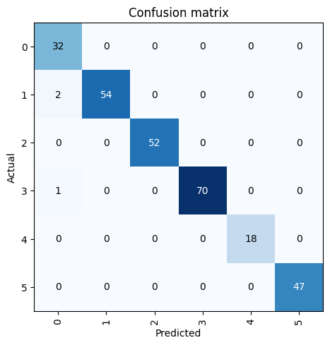
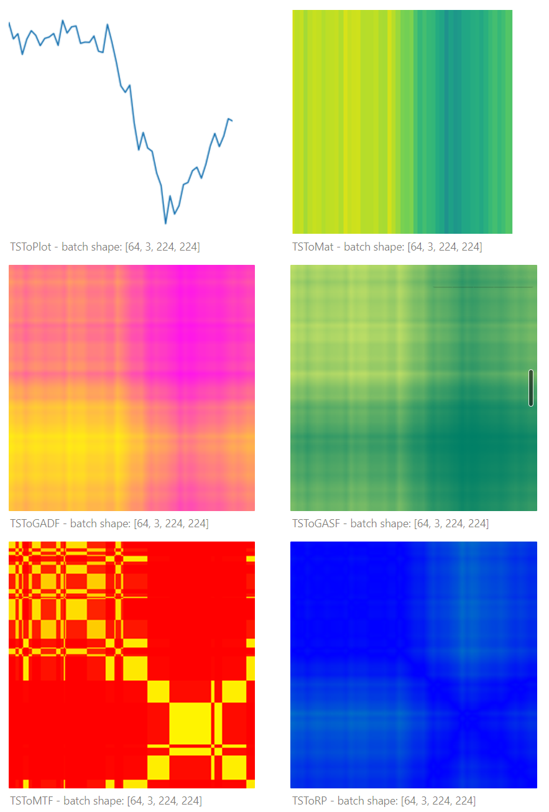
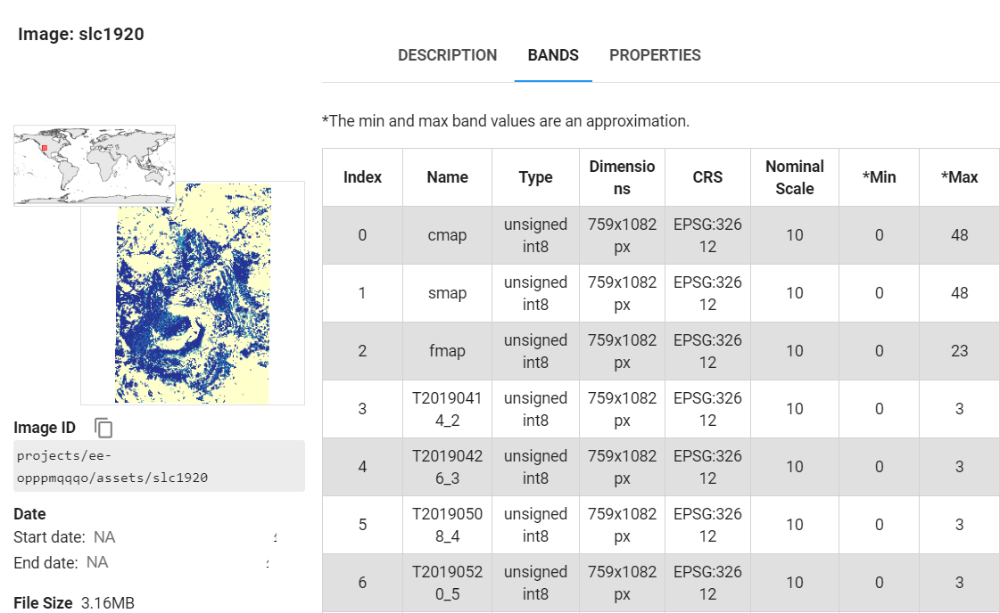

# Regional-ecological-time-series-monitoring-based-on-LandTrendr
*This repo use time series remote sensing image data obtained by LLR&LT for time series clustering and classification based on deep learning.*

## 🧭*Navigation*

- [1.Collect Data](#step-1-collect-data)
- [2.Fit Change Curve(optional)](#step-2-fit-change-curveoptional)
- [3.Time Series Clustering](#step-3-time-series-clustering)
  - [3.1 Intro KShape Clustering](#intro-kshape)
  - [3.2 Usage in Python](#usage-in-python)
  - [3.3 Evaluation](#evaluation)
- [4.Time Series Classification](#step-4-time-series-classification)
  - [4.1 Prepare Data](#prepare-training-data)
  - [4.2 Training](#training-model)
  - [4.3 Result](#classification-result)
  - [4.5 TimeSeries2Image](#%EF%B8%8Ftime-series-to-image)
    - [4.5.1 Convert ts 2 Img](#convert-time-series-to-images-classification)
    - [4.5.2 Begin Training](#begin-training)
    - [4.5.3 Apply to RS Img](#apply-model-to-rs-image)
- [5.SAR Detection](#step-5-sar-detection)
- [Output](#output-images)
- [To Do List](#to-do)
---

## 🤗STEP 1: Collect Data

**Using [`ee-LandsatLinkr`](https://github.com/gee-community/ee-LandsatLinkr) tools in GEE platform or python scrips developed by *Justin Braaten* & *Annie Taylor*.**

- ### Option 1: Collect data with `google colab`🍕

  Click me to get it!⚓ 

- ### Option 2: Collect data in `Google Earth Engine`🌏
  *Follow these steps to complete your data collection, follow this [code](./LLR-LT-GEE/landsatlinkr01.js) according to LLR official tutorial. **You can get all years RS images processed by `LandTrendr` in this code.***

  - View WRS-1 granules - figure out what WRS-1 granule to process
  - Make a processing [***dir***](https://gist.github.com/jdbcode/36f5a04329d5d85c43c0408176c51e6)
  - Create MSS WRS-1 reference image - for MSS WRS1 to MSS WRS2 harmonization
  - View WRS-1 collection - identify bad MSS images
  - Prepare MSS WRS-1 images
  - Get TM-to-MSS correction coefficients.
  - Export MSS-to-TM corrected images
  - Inspect the full time series collection - explore time series via animation and inspector tool to check for noise
  - Run LandTrendr and display the fitted collection on the map
  - Display the year and magnitude of the greatest disturbance during the time series
  
  ***If you don't need original data, all you want is just fitted data, follow this [code](./LLR-LT-GEE/landsatlinkr02.js) (RECOMMENDED)***

*the tutorial is detailed enough, you will get study area data named `LandTrendr` you needed if you follow it step by step in `asset` file folder within your GEE account. you need to storage data in `Google Drive` before you download it to local(because gee doesn't support you download to local directly). you can follow this code to check data and download it to Drive:*
		

	var lt = ee.Image('projects/your_account_name/assets/LandsatLinkr/granules_IDs/landtrendr');
	// 50 Years! 
	var start_yr = 1972;
	var end_yr = 2022;
	var ltr =  lt.select('LandTrendr');
	
	// Create the all years image collection from the LandTrendr output
	var fittedRGBCols = llr.getFittedRgbCol(lt, start_yr, end_yr, rgb_bands, vis_params);
	
	// Get the ImageCollection
	var collection = ee.ImageCollection(fittedRGBCols.rgb); // replace 'rgb' with the actual ID of your ImageCollection
	
	var batch = require('users/fitoprincipe/geetools:batch')
	batch.Download.ImageCollection.toDrive(collection,"041032", {
		scale: 30,
		crs:'EPSG:3857',
		region: geometry,
		type:"float" });

*you also can use this [tool](https://emaprlab.users.earthengine.app/view/lt-gee-time-series-animator) developed by Justin Braaten to see the change of your study area.*

    

***Congratulations!㊗️ As now you have got the original data!🎆***

*If you want to do some preprocess to original images then using LT(written as IDL) in local environment and have run official code, just see **[step2](#step-2-fit-change-curveoptional)**. But LLR may don't work in some region you are interested if you follow LT official tutorial or it's not need for you to obtain images before 1986, so we modify source code to help you achieve this and get change map, you can get it [here](./LLR-LT-GEE/lt_without_mss.js).*

*Or you want to get fitted data by LT-processed directly in GEE, you can follow this [code](./LLR-LT-GEE/landsatlinkr02.js) and **skip step2 and go to [step3](#step-3-time-series-clustering)** after you have completed this step. Now you can get fitted data follow this code after you have stored asset `LandTrendr` in your gee account.*

	var lt = ee.Image('projects/your_account_name/assets/LandsatLinkr/041032/landtrendr');
	// 50 Years! 
	var start_yr = 1972;
	var end_yr = 2022;
	var years = []; // make an empty array to hold year band names
	for (var i = start_yr; i <= end_yr; ++i) years.push('yr'+i.toString()); // fill the array with years from the startYear to the endYear and convert them to string
	var ltr =  lt.select('ndvi_fit'); // just select bands as you want
	var ndvi_ftv_Stack = ltr.arrayFlatten([years]);// flatten this out into bands, assigning the year as the band name
	Export.image.toDrive({
	  image:ndvi_ftv_Stack,
	  scale:30,
	  region:geometry,
	  crs:'EPSG:3857'
	});
	
	// export change map
	// Change Event Detection Year: ('yod' year)
	// Magnitude of the change event: (absolute value of the spectrum increment of the 'mag' change event)
	// Duration of Change Event: ('dur' years)
	// Event Spectral Value Before Change: ('preval' Spectral Value)
	// Spectral rate of change of event 'rate'( mag/dur)
	// DSNR 'dsnr' (mag/fit rmse) multiplied by 100 to preserve the two-digit decimal precision of the Int16 data.
	see change map code in this repo

---
> [!NOTE]  
> These steps will cost lots of time, keep patient🛏️.
---

## 😇STEP 2: Fit Change Curve(optional)
- **use [IDL code](./LT-IDL) to execute [`LandTrendr`](https://github.com/jdbcode/LLR-LandTrendr)**[^1]
  
  - *we develop a GUI to help users to use it.*
  

    
  

  
  - *you'd better know what's meanings of these parameters before run it, following below intro:*
    | **Parameter**          | **Type**          | **Default** | **Definition** |
    |------------------------|-------------------|-------------|----------------------------------------------------------------------------------------------------------------------------------------------------|
    | maxSegments            | _Integer_         |             | Maximum number of segments to be fitted on the time series|
    | spikeThreshold         | _Float_           | _0.9_       | Threshold for dampening the spikes (1.0 means no dampening)|
    | vertexCountOvershoot   | _Integer_         | _3_         | The inital model can overshoot the maxSegments + 1 vertices by this amount. Later, it will be prunned down to maxSegments + 1                      |
    | preventOneYearRecovery | _Boolean_         | _false_     | Prevent segments that represent one year recoveries                                                                                                |
    | recoveryThreshold      | _Float_           | _0.25_      | If a segment has a recovery rate faster than 1/recoveryThreshold (in years), then the segment is disallowed                                        |
    | pvalThreshold          | _Float_           | _0.1_       | If the p-value of the fitted model exceeds this threshold, then the current model is discarded and another one is fitted using the Levenberg-Marquardt optimizer|
    | bestModelProportion    | _Float_           | _1.25_      | Takes the model with most vertices that has a p-value that is at most this proportion away from the model with lowest p-value                      |
    | minObservationsNeeded  | _Integer_         | _6_         | Min observations needed to perform output fitting                                                                                                  
  
  - *now see what we get*
    - **fitted curve**
    - **vertices and values, like `[1972, 1999, 2002, 2021]`**
    - **final segments**
    - **[p value](https://www.investopedia.com/terms/p/p-value.asp)(lower is better)**
    - **[f statistic](https://www.statisticshowto.com/probability-and-statistics/f-statistic-value-test/)(bigger is better)**
  

    
  

  
  - *apply LT to all image, we get time series in 3 bands(ndvi/tcg/tcw), a random sample in Salty Lake City as example*
  

    
	

  
  - *but LT may be disable in some data (AKA `noise`), so after executing LT we had better apply a median filtering.*
    

    
      
    

  
  Congratulations! As now you have got the processed data after LT algorithm!🤞
  If you want to know more infomation about LandTrendr algorithm, we recommend you follow this [`link`](https://emapr.github.io/LT-GEE/index.html)🥳
  
  

  ## 🤖STEP 3: Time Series Clustering
  In this step we use **KShape**[^3] algorothm to achieve our ts data clustering. Before we begain, we'd better know what's **KShape**?
  
  ### *Intro KShape*
  
  The KShape clustering method is a clustering algorithm based on time series data. It groups time series into different clusters by calculating the similarity between them. The key to the KShape clustering method is to match the shape of the time series, not just the numerical value. This enables KShape to discover time series that have similar shapes but not necessarily similar values. The KShape clustering method has wide applications in data analysis in various fields, including finance, medical and weather prediction.The basic steps of the KShape clustering method include:
  - Select the time series data set to cluster.
  - Calculate the similarity between time series, usually using methods such as dynamic time warping (DTW).
  - Clustering based on similarity, commonly used methods include k-means algorithm.
  - Analyze the clustering results and perform further interpretation and application as needed.
  ---
  
  ### *Usage in python*
  
  **There are two ways to use KShape by `python`**
- KShape integrated in tslearn(only CPU engage in calulation)
  there is a simple example:
  
  	  from tslearn.clustering import KShape
	  def kshape_cpu(X, k):
	    print('begin kshape....\n')
	    seed = 0
	    ksc = KShape(n_clusters=k, n_init=5, verbose=True, random_state=seed)
	    ksc.fit(X)
	    print('\nend kshape\n')
	    return ksc

- Independent KShape lib(you can call GPU to accelerate calculation efficiency)
   there is a simple example:

	   from kshape import KShapeClusteringGPU
	   def kshape_gpu(X,k):
	     print('begin kshape gpu...\n')
	     ksg = KShapeClusteringGPU(n_clusters=k)
	     ksg.fit(np.expand_dims(X, axis=2))
	     print('\nend kshape gpu...')
	     return ksg

   ---

   ### *Elbow Law*

   before we run KShape code, we need to define fixed number of clustering, for this we use **Elbow Law** to check probable number of clustering.

	       distortions = []
	       for i in range(4, 8):
	           print('cluster num:', i, '\n-------------')
	           ks = KShape(n_clusters=i, n_init=5, verbose=True, random_state=0)
	           # Perform clustering calculation
	           ks.fit(X)
	           distortions.append(ks.inertia_)
	        plt.plot(range(2, 7), distortions, marker='o')
	        plt.xlabel('Number of clusters')
	        plt.ylabel('Distortion')
	        plt.show()
  
  code above will return a plot like this, you can see *slop* become more gentle when value of *x* equal *5*, so we confirm number of clustering is *5*, but you'd better to draw the centriod to check correct categories, we finally choose 4 categories after drawing centriods of 4 and 5 categories condition.
  
  

    
  

  but sometimes it is doesn't obvious just by this way, so we suggest use `yellowbrick` lib to visualize k-elow-law:
	
	 	from yellowbrick.cluster import KElbowVisualizer	
	 	#Instantiate the clustering model and visualizer
	 	model = KShape(n_init=1, verbose=True, random_state=0)
	 	
	 	#distortion: mean sum of squared distances to centers
	 	#silhouette: mean ratio of intra-cluster and nearest-cluster distance
	 	#calinski_harabasz: ratio of within to between cluster dispersion
	 	
	 	visualizer = KElbowVisualizer(model, k=(4,10),metric='distortion')
	 	
	 	visualizer.fit(img_data)        # Fit the data to the visualizer
	 	visualizer.show()        # Finalize and render the figure
  
  here are visualizations of `elbow law` using three evaluation indexs with `yellowbrick` lib.

  now we can apply KShape to image data we got above with 51 bands, you can just cluster ***Univariate*** data, also you can cluster ***Multivariate*** data.

  **First of all, read data and convert to fomat of time series.**
  - for univariate data clustering, like ndvi ts data `[length(number of ts), time_span(51 for this), variate(1 for this)]`

	    import rasterio
	    #Load the .tif image
	    with rasterio.open("./NDVI51years.tif") as src:
	        image_data = src.read()
	        row = image_data.shape[1]
	        column = image_data.shape[2]
	        # Reshape to (rows, columns, bands)
	        transposed_image_data = np.transpose(image_data, (1, 2, 0))
	
	    print('transposed shape:', transposed_image_data.shape)
	    
	    #Reshape the image data to (rows * columns, bands)
	    img_data = transposed_image_data.reshape(-1,transposed_image_data.shape[2])
	    print('reshaped shape:', img_data.shape)

  - for multivariate data clustering,like `[ndvi, tcg, tcw]` ts data `[length(number of ts), time_span(51 for this), variate(3 for this)]`
    
		import rasterio
		import numpy as np
		from rasterio.transform import Affine
	
		#define image paths
		image_paths = [
			    './ndvi51years.tif',
			     ·········
			    './tcw51years.tif'
			]
		#read image data and reshape to 4D array
		combined_array = []
		for path in image_paths:
			with rasterio.open(path) as src:
		    	array = src.read()
		    	reshaped_array = array.reshape(array.shape[0], -1)
		    	combined_array.append(reshaped_array)
		    	if path == image_paths[0]:
		      		metadata = src.profile
		      		print(metadata)
		
		#convert list to array
		combined_array = np.array(combined_array)
		
		#transpose array to fomat as requires
		combined_array = combined_array.transpose(2, 1, 0)
		
		print(combined_array.shape)
		#save as npy file, you will don't need to read raster data again and again
		np.save("/*/tsdata_samples_51_3.npy",combined_array)
		
		#save metadata
		with rasterio.open('/*/metadata.tif', 'w', **metadata) as dst:
				dst.update_tags(**metadata)
    **Second, draw centroid of clustering, take a look at how kshape breaks down the data into categories**
  

    
    
  

  
4 categories univariate in the left and 5 categories mulitvariate in the right

**Finally, check the result after kshape clustering(univariate for left and multivariate for right)🥳**
  

    
    
  

---
> [!NOTE]  
> These steps will cost lots of time, keep patient🛏️.
---

### *Evaluation*

**but now😕, another question is how to evaluate accuracy of kshape clustering❓**

*alas, tslearn does not seem to provide an evaluation method for KShape clustering. so we recommend you **modify the source code** to achieve it, more information click [here](https://blog.csdn.net/qq_37960007/article/details/107937212). let's see how to realize it. Officially, three similarity measures, dtw-dba, softdtw, and Euclidean distance, are provided in tslearn, but nothing about KShape clustering. Notice that source code, there `metric="precomputed"`, indicates that a user-defined distance metric is provided, which is good, and then the key to evaluating KShape using **`silhouette_score`** is here:*

*here is needed information about `silhouette_score`:*
it is an indicator that measures the tightness and separation of clustering results. It is based on the distance of each sample to other samples within the cluster to which it belongs and the distance to samples in the nearest cluster. The value range of the silhouette coefficient is between [-1, 1]. The closer the value is to 1, the better the sample clustering is. The closer the value is to -1, the worse the sample clustering is.

- Positive value: indicates that the samples are clustered well, and the intra-cluster distance is closer than the inter-cluster distance.
- Negative value: indicates that the samples are poorly clustered, and the distance within clusters is farther than the distance between clusters.
- Close to 0: It means that the distance between samples within and between clusters is similar, and the clustering result is unclear.

*here is e.g. of how to use silhouette_score calculation function `silhouette_score(cdist_dtw(X),y_pred,metric="precomputed")`, so you need to figure out what is `cdist_dtw(X)`❔. Actually realname of it, is measuring distance of time series, different from `Euclidean`, `dtw` and `softdtw`. so here is definition of SBD which is foundation of kshape.*

$SBD(\vec{x},\vec{y})=1-\max_{w}\left(\frac{CC_w(\vec{x},\vec{y})}{\sqrt{R_0(\vec{x},\vec{x})\cdot R_0(\vec{y},\vec{y})}}\right)$

so we add the `_get_norms` function, which is responsible for calculating the modulus length, and the `_my_cross_dist` function, which returns the distance matrix of the temporal collection X, i.e., the matrix formed by the distance between each element ti in X.

	def _get_norms(self,X):
	    norms = []
	    for x in X
	        result = numpy.linalg.norm(x)
		norms.append(result)
	    norms = numpy.array(norms)
	    return norms
	
	def _my_cross_dist(self,X):
	    norms = self._get_norms(X)
	    return 1.-cdist_normalized_cc(X,X,norms1=norms,norms2=norms,self_similarity=False)

*after this we test how it work*🤯

	import numpy as np
	from tslearn.generators import random_walks
	import tslearn.metrics as metrics
	from tslearn.clustering import silhouette_score
	 
	def test_kshape_silhouette_score():
	    seed = 0
	    num_cluster = 2
	    ks = KShape(n_clusters= num_cluster ,n_init= 5 ,verbose= True ,random_state=seed)
	    X = random_walks(n_ts=20, sz=16, d=1) * 10
	    #generate label radomly
	    y_pred = np.random.randint(2, size=20)
	    dists = ks._my_cross_dist(X)
	    #set diagonal elments to zero
	    np.fill_diagonal(dists,0)
	    #calculate silhouette score
	    score = silhouette_score(dists,y_pred,metric="precomputed")
	    print(score)
	   >>>output:0.026772646

---
> [!NOTE]  
> These steps will cost amounts of RAM resource, make sure enough ram space👽.
---

**now, part of time series clustering is done. if you have interest about it, you also can try kmean➕dtw➕dba or kmeans➕softdtw. it's similar workflow. good luck😄**

## 🙉STEP 4: Time Series Classification

- ### *Prepare Training Data*
  
  we generate training data refer to paper[^2] and add some classic categories:
  
  

    
  

  - (1) The sample point was disturbed during the study period but not restored and failed to exhibit vegetation recovery. It is classified as DN and its NDVI values oscillate below the vegetation threshold after a sharp decrease (a).
  - (2) The sample point was disturbed during the study period and was still recovering at the end of the study period. It is classified as DR1 and its NDVI values decline sharply from a vegetated to a non- 
  vegetated state, then increase gradually to a state of less than-full recovery with an upward trend in last several years (b).
  - (3) The sample point was disturbed during the study period and exhibited vegetative stability but did not exhibit full recovery. It is classified as DR2 and its NDVI values decline sharply from a vegetated to a non-vegetated state, then increase gradually to a vegetated status with NDVI values lower than pre-disturbance but with little change in last several years (c).
  - (4) The sample point was disturbed during the study period, was restored to be stable, and exhibited full vegetation recovery. It is classified as DR3 and its NDVI values decline sharply from a vegetated to a non-vegetated state, then increase gradually to a vegetated status that is approaching or exceeding pre-disturbance with little change in last several years (d).
  - (5) The sample point was disturbed prior to the study period and exhibited recovery but did not exhibit a stable state. It is classified as BD1 and its initial NDVI values of pixels are lower than the 
  vegetation threshold but then increase gradually to a level that is no less than the vegetation threshold with an upward trend in last several years (e).
  - (6) The sample point was disturbed prior to the study period was restored to be stable. It is classified as BD2 and its initial NDVI values are lower than the vegetation threshold but then increase gradually 
  to a level that is no less than the vegetation threshold with little change in last several years (f).
  - (7) The sample points exhibited disturbances two or more times (g and h). They are classified as CD, meaning that they had complex disturbance histories.

  we divide them to 6 categories and generate relative pure training data by code. They are `{0 : downward, 1 : dowaward then upward, 2 : upward, 3 : upward then downward, 4 : stable, 5 : multi disturbance}`
  
  
  
  |                      downward                      |                     downward then upward                     |
  | :------------------------------------------------: | :----------------------------------------------------------: |
  |    |      |
  |                     **upward**                     |                   **upward then downward**                   |
  |      |      |
  |                     **stable**                     |                    **multi disturbance**                     |
  |  |  |
  
  ---
  
- ### *Training Model*
  see code we upload in repo. test it in validation dataset
  

  

  
- ### *Classification Result*
  ***here are the classification result after training based on dataset we generated above.***

  

  

  
model info

| Model            | training accuracy | validation accuracy | training loss | validaion loss | accuracy in imgs |
|------------------|-------------------|---------------------|---------------|----------------|-----------------|
| InceptionTime    | 0.939286          | 0.9393              | 0.173723      | 0.157058       | 82%     	|
| Tansformer       | 0.941667          | 0.9542              | 0.571105      | 0.612427       | 80%		|
| MiniRocket       | 0.939286          | N/A                 | 0.176533      | 0.186470       | 72%		|
| CNN Classifier   | 0.921428          | N/A                 | N/A           | N/A            | 63%		|
| TimeSeriesForest | 0.939285          | N/A                 | N/A           | N/A            | 60%		|
| BOSSVS           | 0.792857          | N/A                 | N/A           | N/A            | 53%		|

*you can also draw picture to check predicted probal per ture class and confusion matrix after training, like this:*
  

---

- ### 🖼️*Time Series to Image*
  - #### *convert time series to images classification*
  
  we use `tsai` a friendly ts learning lib to achieve it. there are several methods to convert ts data to images:😮
  
  - **TSToPlot**: Create matplotlib line plots
  - **TSToMat**: Create a matplotlib imshow figure
  - **TSToGADF**: Create an image based on Gramian angle difference field transformation
  - **TSToGASF**: Creates an image based on Gramian angle summation field transformation
  - **TSToMTF**: Create image based on Markov transfer field transformation
  - **TSToRP**: Create images based on recursive graph transformations
  
  you can realize it by following code:

		import numpy as np
		import pandas as pd
		from sklearn.model_selection import train_test_split
		import tsai
		
		# Read the CSV file
		df = pd.read_csv('./datasets.csv')
		
		# Convert the 'dataset' column to numpy arrays
		df['dataset'] = df['dataset'].apply(lambda x: np.array(eval(x)))
		
		# Convert DataFrame to numpy arrays
		data = np.stack(df['dataset'].values)
		
		# Reshape the data to a three-dimensional array
		data = data.reshape(data.shape[0], 1, data.shape[1])
		print(data.shape)
		# Extract labels
		labels = df['label'].values
		X_train, X_test, y_train, y_test = train_test_split(data, labels, test_size=0.2, random_state=42)
		X, y, splits = combine_split_data([X_train, X_test], [y_train, y_test])
		tfms = [None, Categorize()]
		bts = [[TSNormalize(), TSToPlot()],
		       [TSNormalize(), TSToMat(cmap='viridis')],
		       [TSNormalize(), TSToGADF(cmap='spring')],
		       [TSNormalize(), TSToGASF(cmap='summer')],
		       [TSNormalize(), TSToMTF(cmap='autumn')],
		       [TSNormalize(), TSToRP(cmap='winter')]]
		btns = ['Plot', 'Mat', 'GADF', 'GASF', 'MTF', 'RP']
		for i, (bt, btn) in enumerate(zip(bts, btns)):
		    dsets = TSDatasets(X, y, tfms=tfms, splits=splits)
		    dls = TSDataLoaders.from_dsets(dsets.train,
		                                   dsets.valid,
		                                   bs=[64, 128],
		                                   batch_tfms=bt,
		                                   shuffle=False)
		    xb, yb = dls.train.one_batch()
		    print(f'\n\ntfm: TSTo{btn} - batch shape: {xb.shape}')
		    xb[0].show()
		    plt.show()
    ts data will be displayed as image like this:
    

   we choose use TsToGADF to create image after comparison. vasualize result after it:
   

  
    - #### *begin training*

|epoch|train_loss|valid_loss|accuracy|time|
|:---:|:----|:----|:----|:----|
|0|1.825284|1.758930|0.225000|00:09|
|1|1.620805|1.517212|0.496429|00:08|
|2|1.432231|1.289679|0.607143|00:08|
|····|||||
|97|0.000065|0.233326|0.946429|00:08|
|98|0.000066|0.248137|0.946429|00:08|
|99|0.000064|0.244490|0.950000|00:08|

- #### *apply model to RS image*
  
		from sklearn.preprocessing import MinMaxScaler
		
		#Initialize the MinMaxScaler
		scaler = MinMaxScaler()
		
		#Fit and transform the data
		norm_data = scaler.fit_transform(img_data)
		
		#Reshape the data back to standard shape
		norm_data = to3d(norm_data)
		print(norm_data.shape)
		-->(389360, 1, 51)
		#Unlabelled data
		test_ds = dls.dataset.add_test(norm_data)
		test_dl = valid_dl.new(test_ds)
		next(iter(test_dl))
		-->(TSImage(shape:torch.Size([64, 1, 224, 224])),)
		
		test_probas, test_targets, test_decoded = learn.get_preds(dl=test_dl, with_decoded=True, save_preds=None)
		test_decoded]

❌**failed becourse of RAM run out**

## 📡STEP 5: SAR Detection

LT will output *`yod`change map* which means the years of disturbance. for our study region, it would be like this:

use **ENVI** calculate image static, find study region got disturbed mainly in 2012:

we use images captured by *Sentinel-1 A&B* satellites, but consider that *Sentinel* was launched in 2014, so we choose another disturbance year, 2020~2021, both *A&B* satellites, ascending pass(fake true color with cmap/smap/fmap)

For a time series of  k  images, the exported change map consists of  k+2  bands, we gather 19 images, namely 21 bands.

- cmap: the interval of the most recent change, one band, byte values  ∈[0,k−1] , where 0 = no change.
- smap: the interval of the first change, one band, byte values  ∈[0,k−1] , where 0 = no change.
- fmap: the number of changes, one band, byte values  ∈[0,k−1] , where 0 = no changes.
- bmap: the changes in each interval,   k−1  bands, byte values  ∈[0,3] , where 0 = no change, 1 = positive definite change, 2 = negative definite change, 3 = indefinite change.

*Proportion of changed pixels in a small region in Salty Lake City for a 19-image time sequence. There were about 360000 pixels in the aoi. Note the (approximate) alternation of arrivals (positive definite changes) and departures (negative definite changes).*

😣Analyze later....

---

## Output Images
*on the way...*😥

## TO DO
- [x] classification result accuracy evaluation
- [x] add more reliable class to classify dataset
- [ ] remote sensing mapping
- [x] D-InSAR detect surface deformation rely on change map(year of disturbance)

[^1]:Kennedy, Robert E., Yang, Zhiqiang, & Cohen, Warren B. (2010). Detecting trends in forest disturbance and recovery using yearly Landsat time series: 1. LandTrendr - Temporal segmentation algorithms. Remote Sensing of Environment, 114, 2897-2910
[^2]:Zhen Yang, Jing Li, Carl E. Zipper, Yingying Shen, Hui Miao, Patricia F. Donovan, Identification of the disturbance and trajectory types in mining areas using multitemporal remote sensing images,Science of The Total Environment,Volume 644,2018,Pages 916-927,ISSN 0048-9697,https://doi.org/10.1016/j.scitotenv.2018.06.341.
[^3]:John Paparrizos Columbia University jopa@cs.columbia.edu Luis Gravano Columbia University gravano@cs.columbia.edu k-Shape: Efficient and Accurate Clustering of Time Series. 
